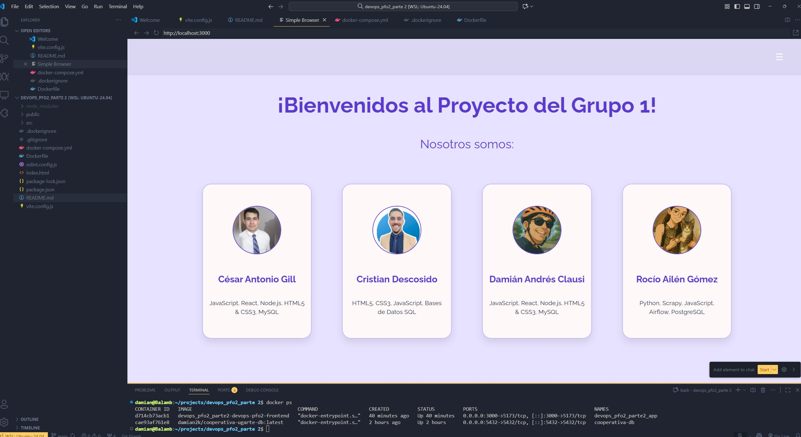

# DevOps PFO2 Parte 2 - Proyecto Programación Web (Front End)

**Repositorio:** https://github.com/damianclausi/devops_pfo2_parte2  
**Materia:** Programación Web (Front End)  
**Fecha:** Octubre 2025  
**Basado en:** https://github.com/damianclausi/tp1-react-grupo1

---

## Descripción del Proyecto

Este repositorio contiene el proyecto de programación Web (front end) desarrollado con **React** y **Vite**, completamente **dockerizado** para facilitar el despliegue y desarrollo en contenedores.

### Objetivos DevOps Cumplidos

- Repositorio GitHub creado con `gh devops_pfo2_parte2`
- Contenedor Docker configurado con todos los servicios necesarios
- Documentación completa con comandos de ejecución y puertos
- Imagen subida a Docker Hub

### Prueba del Sistema



*Sistema ejecutándose correctamente en contenedor Docker*

---

## Stack Tecnológico

- **React 19.1.0** - Biblioteca de JavaScript para interfaces de usuario
- **Vite 6.3.5** - Herramienta de construcción y desarrollo rápido
- **React Router DOM** - Navegación entre páginas
- **React Icons** - Iconografía
- **Docker** - Contenedorización
- **Node.js 20 Alpine** - Imagen base del contenedor

---

## Comandos Docker Ejecutados

### Comando Principal para Ejecutar

```bash
docker-compose up --build
```

### Comandos Adicionales

```bash
# Ejecutar en segundo plano
docker-compose up -d --build

# Detener el contenedor
docker-compose down

# Ver contenedores en ejecución
docker ps

# Ver logs del contenedor
docker-compose logs
```

### Configuración de Puertos

- **Puerto del host:** 3000
- **Puerto del contenedor:** 5173
- **URL de acceso:** http://localhost:3000

---

## Docker Hub

**Imagen disponible en:** https://hub.docker.com/r/damian2k/devops-pfo2-frontend

### Ejecutar desde Docker Hub

```bash
# Descargar y ejecutar directamente
docker run -p 3000:5173 damian2k/devops-pfo2-frontend:latest

# Ejecutar en segundo plano
docker run -d -p 3000:5173 damian2k/devops-pfo2-frontend:latest
```

### Comandos utilizados para subir a Docker Hub

```bash
# Construir imagen con tag específico
docker build -t damian2k/devops-pfo2-frontend:latest .

# Subir imagen
docker push damian2k/devops-pfo2-frontend:latest
```

---

## Archivos de Configuración

### Dockerfile

```dockerfile
# Usar imagen base de Node.js 20 Alpine para un contenedor más ligero
FROM node:20-alpine

# Establecer el directorio de trabajo
WORKDIR /app

# Copiar archivos de dependencias
COPY package*.json ./

# Instalar todas las dependencias (incluyendo devDependencies para desarrollo)
RUN npm ci

# Copiar el código fuente
COPY . .

# Exponer el puerto 5173 (puerto por defecto de Vite)
EXPOSE 5173

# Comando para ejecutar la aplicación en modo desarrollo
CMD ["npm", "run", "dev", "--", "--host", "0.0.0.0"]
```

### docker-compose.yml

```yaml
services:
  devops-pfo2-frontend:
    build: .                          # Construir desde Dockerfile
    container_name: devops_pfo2_parte2_app
    ports:
      - "3000:5173"                   # Mapeo puerto host:contenedor
    volumes:
      - .:/app                        # Sincronizar código fuente
      - /app/node_modules            # Volumen para node_modules
    environment:
      - NODE_ENV=development          # Entorno de desarrollo
    stdin_open: true                  # Mantener STDIN abierto
    tty: true                        # Asignar pseudo-TTY
    networks:
      - frontend-network

networks:
  frontend-network:
    driver: bridge                    # Red bridge para contenedores
```

---

## Problemas y Soluciones

### Problema 1: Dependencias de Desarrollo No Instaladas
**Error:** `sh: vite: not found`  
**Solución:** Cambiar de `npm ci --only=production` a `npm ci` en el Dockerfile

### Problema 2: Incompatibilidad de Versión de Node
**Error:** React Router requiere Node.js >=20.0.0  
**Solución:** Actualizar imagen base de `node:18-alpine` a `node:20-alpine`

### Problema 3: Acceso desde Host al Contenedor
**Error:** Aplicación no accesible desde localhost:3000  
**Solución:** Configurar Vite con `--host 0.0.0.0` y actualizar vite.config.js

### Problema 4: Hot-Reload No Funcionaba
**Error:** Cambios en código no se reflejaban automáticamente  
**Solución:** Agregar `usePolling: true` en configuración de Vite

---

## Estructura del Proyecto

```
src/
├── components/          # Componentes reutilizables
├── pages/              # Páginas de la aplicación
├── assets/             # Recursos estáticos
├── data/               # Datos JSON
├── App.jsx             # Componente raíz
└── main.jsx            # Punto de entrada

public/                 # Archivos públicos
├── caratulas/          # Imágenes de películas
└── vite.svg           # Logo de Vite

# Archivos Docker
Dockerfile              # Definición del contenedor
docker-compose.yml      # Orquestación de servicios
.dockerignore          # Archivos excluidos del build
```

---

## Equipo de Desarrollo

| Nombre                | Responsabilidad                    |
|----------------------|-----------------------------------|
| Damián Andrés Clausi | Desarrollo y configuración Docker |

---

## Desarrollo Local (sin Docker)

```bash
# Instalar dependencias
npm install

# Ejecutar en desarrollo
npm run dev

# Construir para producción
npm run build

# Previsualizar build
npm run preview
```

---

## Características del Contenedor

- **Imagen base:** node:20-alpine
- **Puerto expuesto:** 5173
- **Puerto mapeado:** 3000 → 5173
- **Volúmenes:** Código fuente sincronizado para desarrollo
- **Hot reload:** Habilitado para desarrollo en tiempo real
- **Red:** frontend-network para comunicación entre contenedores

---

## Funcionalidades de la Aplicación

- Single Page Application (SPA) con React
- Navegación con React Router
- Consumo de APIs externas (CoinGecko, DragonBall, etc.)
- Gestión de datos locales (películas desde JSON)
- Diseño responsivo
- Interfaz moderna y atractiva

---

> **Proyecto desarrollado para DevOps PFO2 Parte 2**  
> Tecnicatura en Desarrollo de Software  
> Octubre 2025
